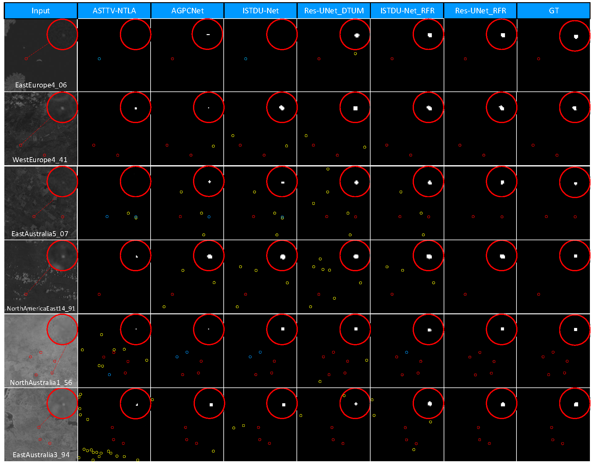

# *<center>Infrared Small Target Detection in Satellite Videos: A New Dataset and A Novel Recurrent Feature Refinement Framework</center>*

## IRSatVideo-LEO Dataset
***IRSatVideo-LEO is a large-scale dataset for multi-frame infrared small target (MIRST) detection in LEO satellite videos. IRSatVideo-LEO is a semi-simulated dataset with a real satellite background image and synthesized satellite motion, target appearance, trajectory and intensity. IRSatVideo-LEO consists of 200 image sequences, 91021 frames and 218038 targets, and we provide instance-level segmentation annotations to offer a infrared LEO satellite videos benchmark for MIRST detection and tracking.***<br>

### Downloads
[[Baidu Yun DownLoads]](https://pan.baidu.com/s/1fx3kShAS-EYMXElz2it2sw?pwd=1113)

### Implementation

<center></center>
Fig. 1 Implementation details of the IRSatVideo-LEO dataset. <br><br>

Table 1 Details of parameters for data generation.
<center></center>

### Benchmark Properties

Table 2 Statical comparisons among existing SIRST and MIRST detection datasets and our IRSatVideo-LEO dataset.
<center></center>
<br>

<center></center>
Fig. 2 Illustrations of sequence attributes.<br> 

<center></center>
Fig. 3 Illustrations of target attributes.<br> 

<center></center>
Fig. 4 Illustration of background attributes and example images.<br><br> 

## Recurrent Feature Refinement Framework

### Overview
<center></center>
Fig. 5 The proposed architecture of recurrent feature refinement framework.
<br>

### Requirements
- Python 3.8
- pytorch (1.10.1+cu11.1), torchvision (0.11.2+cu11.1)

### Build 
DCN Compiling
1. Cd to ```./codes/model/dcn```.
2. Run ```bash make.sh```. The scripts will build D3D automatically and create some folders.
3. See `test.py` for example usage.

### Commands for Training
* Run `train.py` to perform network training. Example for training [model_name] on [dataset_name] datasets:
  ```
  $ cd ./codes
  $ python train.py --model_name ['ISTUDNet_RFR', 'ResUNet_RFR'] --dataset_name ['IRSatVideo-LEO']
  ```
* Checkpoints and Logs will be saved to `./codes/log/`, and the `./codes/log/` has the following structure:
  ```
  ├──./codes/log/
  │    ├── [dataset_name]
  │    │    ├── [model_name]_20.pth.tar
  ```
<be>

### Datasets
Download the [IRSatVideo-LEO Dataset](https://pan.baidu.com/s/1fx3kShAS-EYMXElz2it2sw?pwd=1113) dataset and put the images in `./codes/data/IRSatVideo-LEO`.  
```
  IRSatVideo-LEO
    └── images
        ├── AfricaWest-1_38
            ├── 0000.png
            ├── 0001.png
            ├── ...
        ├── EastAfrica-0
            ├── 0000.png
            ├── 0001.png
            ├── ...
        ├── ...
    └── masks
        ├── AfricaWest-1_38
            ├── 0000.png
            ├── 0001.png
            ├── ...
        ├── EastAfrica-0
            ├── 0000.png
            ├── 0001.png
            ├── ...
        ├── ...		
    └── video_idx
        ├── train_IRSatVideo-LEO.txt
        ├── test_IRSatVideo-LEO.txt
        ├── test_IRSatVideo-LEO-easy.txt
        ├── test_IRSatVideo-LEO-middle.txt
        ├── test_IRSatVideo-LEO-hard.txt
    └── img_idx
        ├── AfricaWest-1_38.txt
        ├── EastAfrica-0.txt
        ├── ...      
```

### Commands for Test
* Run `test.py` to perform network inference. Example for test [model_name] on [dataset_name] datasets:
  ```
  $ cd ./codes
  $ python test.py --model_name ['ISTUDNet_RFR', 'ResUNet_RFR'] --dataset_name ['IRSatVideo-LEO'] --save_img True
  ```
  
* The PA/mIoU and PD/FA values of each dataset will be saved to `./test_[current time].txt`<br>
* Network preditions will be saved to `./results/` that has the following structure:
  ```
  ├──./results/
  │    ├── [dataset_name]
  │    │   ├── [model_name]
  │    │   │    ├── 0000.png
  │    │   │    ├── 0001.png
  │    │   │    ├── ...
  ```
### Results
Table 3 $P_d$ ($\times 10^{-2}$), $F_a$($\times 10^{-6}$) values achieved by different methods on IRSatVideo-LEO dataset.
<center></center>

<center></center>
Fig. 6 Qualitative results of different methods.

### Contact
Please contact us at ***yingxinyi18@nudt.edu.cn*** for any questions.

### Citiation
```
@article{RFR,
  author = {Xinyi Ying, Li Liu, Zaipin Lin, Yangsi Shi, Yingqian Wang, Ruojing Li, Xu Cao, Boyang Li, Shilin Zhou},
  title = {Infrared Small Target Detection in Satellite Videos: A New Dataset and A Novel Recurrent Feature Refinement Framework},
  journal = {Arxiv},
  year = {2024},
}
```
